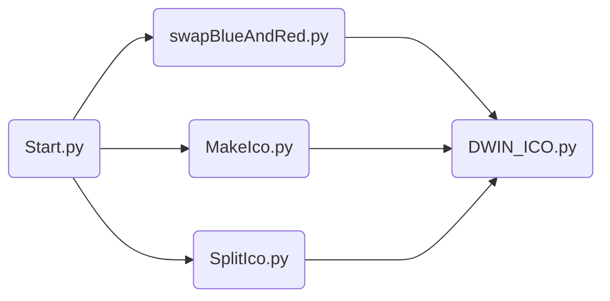

# Bienvenido to dwin-ico-tools!
## Contexto
Las pantallas LCD DWIN utilizan una serie de archivos de imágenes y contenedores para aplicar un aspecto a los elementos de la interfaz de usuario en la pantalla. Estas pantallas se utilizan en Creality's Ender 3 v2 y otras impresoras 3D, y los archivos de configuración para admitir estas pantallas se incluyen en el firmware de Marlin.

Un archivo que utilizan es "9.ICO", que es un archivo estructurado que contiene los iconos. Este proyecto contiene dos herramientas para ayudar a los desarrolladores a manipular estos archivos ICO.


## ¿Qué es?

**dwin-ico-tools** Es un proyecto que permite generar archivos .ICO a partir de una carpeta con los íconos en formato  .JPG y a partir de un archivo .ICO extraer los iconos en su interior.
	
- make-ico: JPG --> ICO
- split-ico: ICO --> JPG

## Requisitos 

Para que el proyecto funcione correctamente se debe tener instalado:
- Python 3
Si aún no lo tiene puede descargarlo en:
https://www.python.org/downloads/
Es necesario instalar las siguientes dependencias, se pueden instalar con pip:
```javascript
python3 -m pip install pillow
```

Opcional:
- VS Code
Lo puede obtener en :
https://code.visualstudio.com

## Instrucciones de uso
Es indispensable tener Python 3 instalado.
Lo primero será instalar las dependencias correspondientes,  las puede instalar con pip.
```javascript
python3 -m pip install pillow
```
### Make-Ico
Make-Ico permite crear un archivo .ICO a partir de una carpeta con íconos en su interior en formato .JPG
Pasos:
-  Copiar tu carpeta de iconos dentro del repositorio del proyecto.
-[Inserte imagen]
- Correr el archivo **`start.py`**. Puedes ejecutarlo en el PowerShell mediante el siguiente comando estando dentro del directorio raíz del proyecto: 

- Seleccionar la opción 2 (MakeIco) y presione Enter.
- A continuación se deberá escribir el nombre de la carpeta con los íconos y presionar Enter.
- Colocar el nombre que tendrá el archivo .ICO y presionar Enter.
- Verificar el archivo en el directorio.

### Split-Ico
Split-Ico permite descomprimir un archivo .ICO para obtener una carpeta con íconos en su interior en formato .JPG
Pasos:
-  Copiar el archivo .ICO dentro del repositorio del proyecto.
-[Inserte imagen]
- Correr el archivo start.py. Puedes ejecutarlo en el PowerShell mediante el siguiente comando estando dentro del directorio raíz del proyecto: 

- Seleccionar la opción 1 (SplitIco) y presione Enter.
- A continuación se deberá escribir el nombre del archivo .ICO y presionar Enter.
- Colocar el nombre que tendrá la carpeta en donde se descomprimirá y presionar Enter.
- Verificar el archivo en el directorio.

## Diagrama

El diagrama de funcionamiento representa la forma que interactúan los diferentes archivos del proyecto.


## Archivos 
En el repositorio se encuentran varios archivos, a continuación se explica el funcionamiento de cada uno:

| Archivo        |Función                        
|----------------|-------------------------------|
|`START.py`|`Contiene el menú del proyecto y las llamadas a los demás métodos `            |
|`makeIco.py`|`Construye el .ICO haciendo uso de DWIN_ICO.py `            |
|`splitIco.py`|`Descomprime el .ICO  haciendo uso de DWIN_ICO.py`|
|`swapBlueAndRed.py`|`Intercambiar canales B y R de archivos JPEG`|
|`DWIN_ICO.py`|`Disecciona y crea archivos DWIN .ico para sus pantallas LCD.`|


## Autor

Este proyecto no es de mi autoría, es un remix del proyecto Original mejorado y traducido al español.
Autor original: https://github.com/b-pub/dwin-ico-tools
-   Brent Burton [[@b-pub](https://github.com/b-pub)]

## Licencia

dwin-ico-tools se publica bajo la licencia GPL 3. Vea el archivo de LICENCIA para más detalles.
